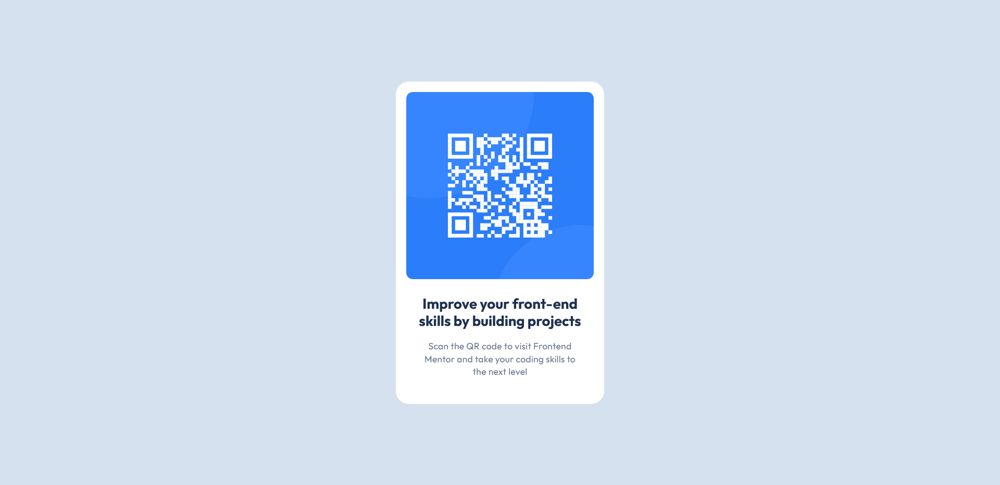

# Frontend Mentor - QR code component solution

This is my solution to the [QR code component challenge on Frontend Mentor](https://www.frontendmentor.io/challenges/qr-code-component-iux_sIO_H).
A small project for refreshing basic HTML and CSS layout skills.

## Table of contents

- [Overview](#overview)
  - [Screenshot](#screenshot)
  - [Links](#links)
- [My process](#my-process)
  - [Built with](#built-with)
- [Author](#author)

## Overview

### Screenshot

### Links

- Solution URL: [GitHub Repository](https://github.com/lxkask/qr-code-component)
- Live Site URL: [Live Demo on GitHub Pages](https://lxkask.github.io/qr-code-component/)

## My process

### Built with

- HTML5
- CSS (Flexbox, custom properties)
- Mobile-first workflow
- Google Fonts (Outfit)

## Author

- GitHub - [@lxkask](https://github.com/lxkask)
- Instagram - [@l.xkas](https://www.instagram.com/l.xkas/)
- LinkedIn - [Lukáš Kubík](https://www.linkedin.com/in/luk%C3%A1%C5%A1-kub%C3%ADk-251605245/)
